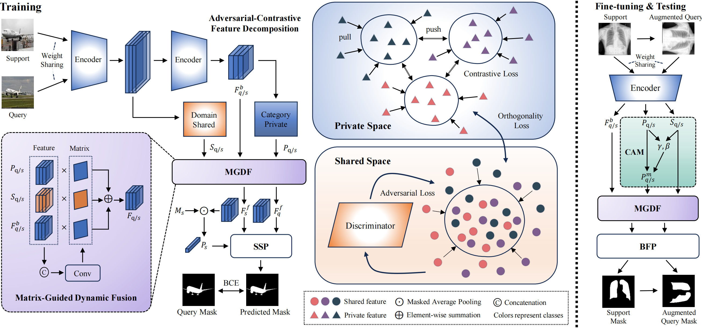

# [AAAI 2026 Oral] Divide-and-Conquer Decoupled Network for Cross-Domain Few-Shot Segmentation

The official implementation of "Divide-and-Conquer Decoupled Network for Cross-Domain Few-Shot Segmentation".

More detailed information is in the [PAPER](https://arxiv.org/abs/2511.07798).

Authors: Runmin Cong, Anpeng Wang, Bin Wan, Cong Zhang, Xiaofei Zhou, Wei Zhang

<p align="middle">
    
</p>

## Datasets
The following datasets are used for evaluation in CD-FSS:

### Source domain:
* **PASCAL VOC2012**:

    Download PASCAL VOC2012 devkit (train/val data):
    ```bash
    wget http://host.robots.ox.ac.uk/pascal/VOC/voc2012/VOCtrainval_11-May-2012.tar
    ```
    Download PASCAL VOC2012 SDS extended mask annotations from [[Google Drive](https://drive.google.com/file/d/10zxG2VExoEZUeyQl_uXga2OWHjGeZaf2/view?usp=sharing)].

### Target domains:
* **Deepglobe**:

    Home: http://deepglobe.org/

    Direct: https://www.kaggle.com/datasets/balraj98/deepglobe-land-cover-classification-dataset

    Data Preprocessing Code: Please refer preprocess_deepglobe.py or [PATNet repo](https://github.com/slei109/PATNet).

* **ISIC2018**:

    Home: http://challenge2018.isic-archive.com

    Direct (must login): https://challenge.isic-archive.com/data#2018

    Class Information: data/isic/class_id.csv

    Data Preprocessing Code: Please refer preprocess_isic.py or [PATNet repo](https://github.com/slei109/PATNet).

* **Chest X-ray**:

    Home: https://www.ncbi.nlm.nih.gov/pmc/articles/PMC4256233/

    Direct: https://www.kaggle.com/datasets/nikhilpandey360/chest-xray-masks-and-labels

* **FSS-1000**:

    Home: https://github.com/HKUSTCV/FSS-1000

    Direct: https://drive.google.com/file/d/16TgqOeI_0P41Eh3jWQlxlRXG9KIqtMgI/view

For convenience, you can also download the target domain datasets directly from our organized [Baidu Netdisk](https://pan.baidu.com/s/1_GUff9OX03S-SyRBjXHFJQ?pwd=vc29).

## Pre-trained ResNet Models

Download pre-trained ResNet models: [GoogleDrive](https://drive.google.com/file/d/1HlyNsgYr9RYbbpPrE7FB6bc_2wCPBEx_/view?usp=sharing) or [Baidu Netdisk](https://pan.baidu.com/s/1yOUPfa_DFNhT6EoxG5Mcqg?pwd=5yx8).

Download SSP pre-trained models: [GoogleDrive](https://drive.google.com/file/d/1NBpgKctAx9h27XdnAOLXlyjdSVrx5EG6/view?usp=sharing) or [Baidu Netdisk](https://pan.baidu.com/s/1EkETN-GNUR0VQZHN81C1bw?pwd=jr9n).


### File Organization
```
    DCDNet/                                             # project file
    ├── dataset/                                        # dataset
    |   ├── VOC2012/                                    # source dataset: pascal voc 2012
    |   |   ├── JPEGImages/
    |   |   └── SegmentationClassAug/
    |   ├── Deepglobe                                   # target dataset: deepglobe
    |   |   ├── 1/                                      # category
    |   |   |   └── test/
    |   |   |       ├── origin/                         # image
    |   |   |       └── groundtruth/                    # mask
    |   |   ├── 2/                                      # category
    |   |   └── ...                                     
    |   ├── ISIC                                        # target dataset: isic
    |   |   ├── ISIC2018_Task1-2_Training_Input/        # image
    |   |   |   ├── 1/                                  # category
    |   |   |   └── ...
    |   |   └── ISIC2018_Task1_Training_GroundTruth/    # mask
    |   |       └── ...
    |   ├── LungSegmentation/                           # target dataset: chest x-ray
    |   |   ├── CXR_png/                                # image
    |   |   └── masks/                                  # mask
    |   └── FSS-1000                                    # target dataset: fss-1000
    |       ├── ab_wheel/                               # category
    |       └── ...
    |
    ├── pretrained/                                     # pretrained resnet models
    |   ├── resnet50.pth
    |   └── Ori_SSP_trained_on_VOC.pth
    |
    └── trained_models/                                 # official trained models
        ├── deepglobe/                                  # target dataset
        └── ...
```

## Environment

Conda environment settings:

```bash
conda create -n dcdnet python=3.10
conda activate dcdnet

pip install uv

# Install PyTorch 2.2.0 with CUDA 12.1
uv pip install torch==2.2.0 torchvision==0.17.0 torchaudio --index-url https://download.pytorch.org/whl/cu121

uv pip install -r requirements.txt
```

## Run the code

Here is an example on ISIC dataset:

First, you need to train a model on the source dataset:
```
python train.py --data-root ./dataset --dataset isic --cuda 0
```

Then, you need to fine-tuning the trained model on the target dataset:
```
python finetuning.py  --data-root ./dataset --dataset isic --cuda 0
```

You can use our trained models for evaluation directly:
```
python test.py --data-root ./dataset --dataset isic --cuda 0
```

Please note that the performances may flutuate within a small range because of differnet batch-sizes, seeds, devices, and environments.

## Citation

If you use this codebase for your research, please consider citing:

```
@article{cong2025divide,
  title={Divide-and-Conquer Decoupled Network for Cross-Domain Few-Shot Segmentation},
  author={Cong, Runmin and Wang, Anpeng and Wan, Bin and Zhang, Cong and Zhou, Xiaofei and Zhang, Wei},
  journal={arXiv preprint arXiv:2511.07798},
  year={2025}
}
```

## Acknowledgement
Our codebase is built based on [IFA](https://github.com/niejiahao1998/IFA) and [SSP](https://github.com/fanq15/SSP)'s official code.

We also thank [PATNet](https://github.com/slei109/PATNet) and other FSS and CD-FSS works for their great contributions.

## Reference

[1] Shuo Lei, Xuchao Zhang, Jianfeng He, Fanglan Chen, Bowen Du, and Chang-Tien Lu. Cross-domain few-shot semantic segmentation. ECCV, 2022.

[2] Jiahao Nie,  Yun Xing, Gongjie Zhang, Pei Yan, Aoran Xiao, Yap-Peng Tan, Alex C Kot, Shijian Lu. Cross-Domain Few-Shot Segmentation via Iterative Support-Query Correspondence Mining. CVPR, 2024.
